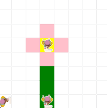

# Unit 1 - Asphalt Art

## Introduction

Cities use asphalt art to improve public safety, inspire their residents and visitors, and brighten communities. Your goal is to create asphalt art to revitalize The Neighborhood and bring the community together with the help of the Painter.

## Requirements

Use your knowledge of object-oriented programming, algorithms, the problem solving process, and decomposition strategies to create asphalt art:
- **Create a new subclass** – Create at least one new subclass of the PainterPlus class that is used for a component of the asphalt art design.
- **Plan an algorithm** – Use the problem solving process and decomposition strategies to plan an algorithm that incorporates a combination of sequencing, selection, and/or iteration.
- **Write a method** – Write at least one method in a PainterPlus subclass that contributes to a component of the asphalt art design.
- **Document your code** – Use comments to explain the purpose of the methods and code segments.

## Notes: Neighborhood & Painter Class

This project was created on Code.org's JavaLab platform using the built-in Neighborhood GUI output. To test and edit this project you must build in Code.org's JavaLab with the Neighborhood GUI enabled. For reference to the Painter class documentation, [you can read more here.](https://studio.code.org/docs/ide/javalab/classes/Painter)

## Output:

## Reflection

1. Describe your project.

- I decided to make a mural art project of a flower with a yellow pistil, pink petals, and a green stem.

2. What are two things about your project that you are proud of?

- I am proud that I was able to make different classes and assign new attributes into them. Another thing I am proud of is adding more painters to help paint the art.

3. Describe something you would improve or do differently if you had an opportunity to change something about your project.

- If i could change something about my project, I would probably change the flower to look more detailed with multi-colored petals.

4. How is this project related to STEAM (Science, Technology, Engineering, Art, and Mathematics)? Provide explicit examples from the project and details as possible. 

- This project is related to STEAM because it helps improve thinking and allows the coder to come up with new ways to find and debug code. For example, I used while loops and if statements which helped to shorten my code and make it easier to read. There were a few errors, but thanks to the console I was able to find the issue and fix it.

5. What SLOs did you demonstrate during completing this project?

- I demonstrated SLOs such as problem solving, debugging, and using coding concepts. For example, while loops and if statements.